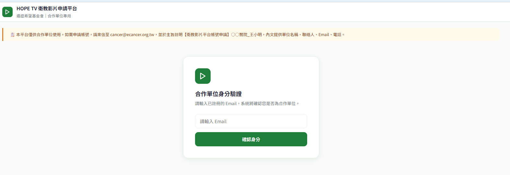
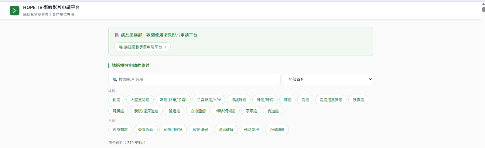
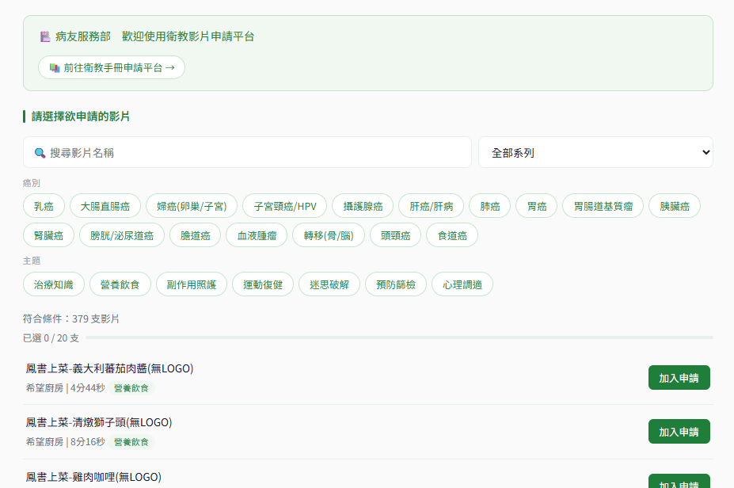
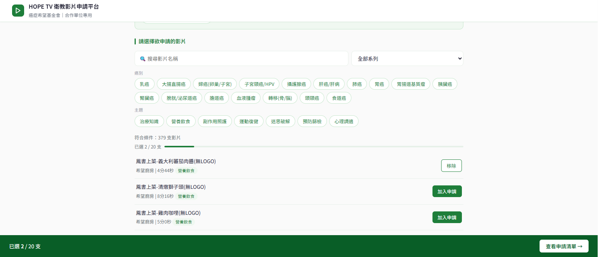
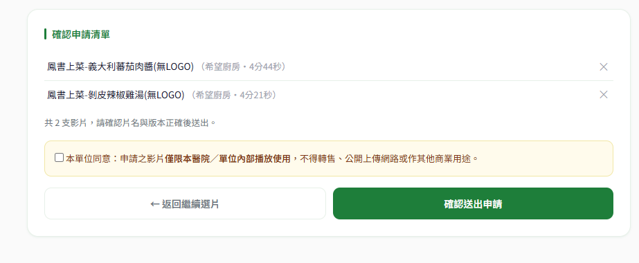
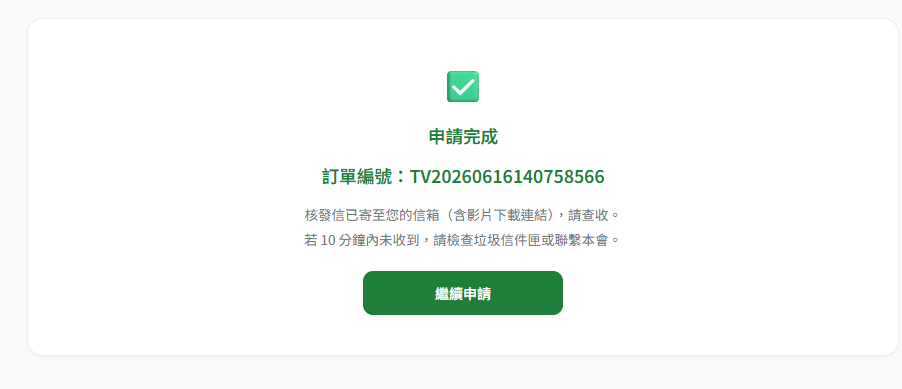
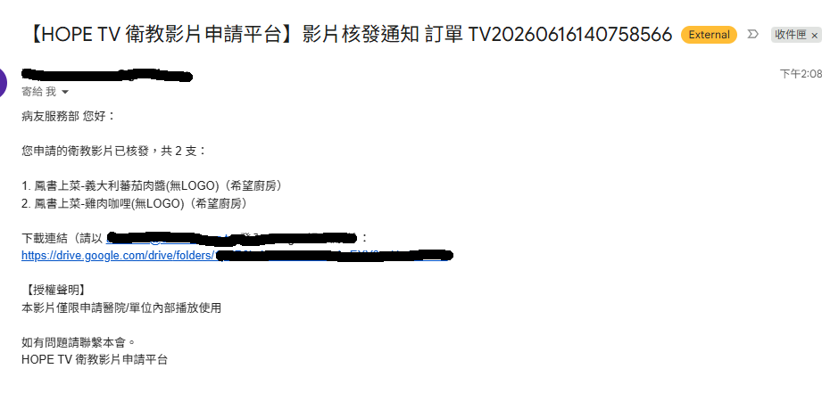

# HOPE TV 衛教影片申請平台 使用說明手冊

> 癌症希望基金會　·　合作單位專用　·　版本 v1.0　·　2026 年 6 月

---

## 一、關於本平台

過去，您若需要取得衛教影片，需來回以 Email 洽詢，流程費時。現在，癌症希望基金會為合作單位建立了線上申請平台，讓您可以：

- 🎬 隨時瀏覽目前開放申請的衛教影片
- 🖱️ 線上選片，就像網路購物一樣方便
- 📩 申請完成後，系統自動將影片下載連結寄至您的信箱

> 💡 請放心使用！平台操作步驟簡單，只需要幾分鐘就能完成申請。

---

## 二、開始使用前的準備

本平台僅供合作單位使用，需要先申請帳號才能登入。

### 如何申請帳號？

請來信至以下信箱，並提供下列資料：

| 需要提供的資料 | 範例 |
| --- | --- |
| 單位名稱 | ○○醫院／○○基金會 |
| 聯絡人姓名 | 王小明 |
| 聯絡人 Email | wang@hospital.com.tw |
| 聯絡人電話 | 02-1234-5678 |

📧 申請信箱：****

✉️ 信件主旨（請直接複製貼上）：

> 【衛教影片平台帳號申請】○○醫院_王小明

（請將「○○醫院」替換為您的單位名稱、「王小明」替換為聯絡人姓名）

收到您的來信後，基金會人員將盡快為您開通帳號，並以 Email 通知您。

> ⚠️ 您登入平台時使用的就是這組 Email，請務必填寫正確、且常用的信箱。

---

## 三、登入平台

### 步驟 1：開啟平台網址

請開啟**帳號開通信中提供的平台網址**（建議使用 Google Chrome 瀏覽器）。

> 💡 基於資訊安全考量，平台網址僅於帳號開通信中提供，不對外公開。開啟後請加入瀏覽器書籤，方便下次快速開啟。

### 步驟 2：輸入 Email

開啟平台後，您會看到身分驗證畫面。請在輸入框中填入您**申請帳號時登記的 Email**，再按下「確認身分」。

### 步驟 3：進入平台

驗證成功後，畫面上方會顯示您的單位名稱，代表已成功登入。

### 登入常見狀況

| 畫面顯示訊息 | 原因 | 處理方式 |
| --- | --- | --- |
| 此 Email 尚未註冊 | Email 未申請帳號或輸入錯誤 | 確認輸入的 Email 是否正確，或來信申請帳號 |
| 帳號已停用 | 帳號遭停用 | 來信  洽詢 |

---

## 四、瀏覽與選擇影片

登入後，您會看到目前所有開放申請的影片清單。

### 認識畫面

畫面主要分為兩個區域：

- **上方篩選區：**可用關鍵字、系列、癌別、主題快速找到想要的影片
- **下方影片清單：**顯示符合條件的影片，每筆顯示影片名稱、所屬系列、片長、語言版本與標籤

### 搜尋與篩選影片

您可以用以下幾種方式找到需要的影片：

- **關鍵字搜尋：**在「搜尋影片名稱」欄位輸入關鍵字，即時顯示符合結果
- **依系列篩選：**點擊下拉選單，選擇特定系列，例如「希望廚房」、「抗癌攻略」
- **依癌別篩選：**點擊癌別標籤，例如「乳癌」、「肺癌」，可篩選相關影片
- **依主題篩選：**點擊主題標籤，例如「治療知識」、「營養飲食」，可篩選相關影片

> 💡 篩選條件可以同時使用多個，例如同時選取「乳癌」＋「副作用照護」。

### 加入申請清單

找到需要的影片後，點擊該影片右側的「加入申請」按鈕，即可加入申請清單。

申請清單說明：

- 畫面上方的進度條會顯示目前已選取的影片數量
- 單筆申請**最多可選取 20 支**影片
- **超過 20 支時，請先送出這筆申請，再另行申請**

> ⚠️ 如需移除已加入的影片，點擊「移除」按鈕即可。

---

## 五、確認並送出申請

選好影片後，點擊畫面下方的「查看申請清單」按鈕，進入確認頁面。

### 確認申請清單

確認頁面會列出所有您選取的影片，包含影片名稱、所屬系列、語言版本與片長。如需調整，可點擊影片右側的「✕」移除，或點擊「← 返回繼續選片」回到清單繼續選取。

### 勾選授權聲明

送出前，請閱讀並勾選以下聲明：

> 📄 本單位同意：申請之影片**僅限本醫院／單位內部播放使用**，不得轉售、公開上傳網路或作其他商業用途。

> ⚠️ 未勾選授權聲明，將無法送出申請。

### 送出後會發生什麼事？

申請送出後：

- 畫面顯示「申請完成」與訂單編號
- 系統自動將影片下載連結寄至您的 Email 信箱
- **請以申請時登記的 Email 所對應的 Google 帳戶開啟連結**

> ⚠️ 若超過 1 個工作天仍未收到信件，請來信 ，並於主旨註明您的訂單編號。

---

## 六、開啟影片下載連結

收到核發信後，點擊信中的連結即可開啟影片資料夾。

> ⚠️ 重要：請用申請時登記的 Email 登入 Google 帳戶後再開啟連結，否則系統會顯示無權限存取。

---

## 七、常見問題

### 帳號相關

**Q：我忘記自己申請帳號用的 Email 是哪一個，怎麼辦？**
A：請來信 ，由基金會人員協助確認。

**Q：我的帳號顯示「帳號已停用」，怎麼辦？**
A：請來信  洽詢，基金會人員將協助確認帳號狀態。

### 申請影片相關

**Q：我可以一次申請多支影片嗎？**
A：可以，單筆申請最多可選取 20 支影片，一次送出即可。若需申請超過 20 支，請分批送出。

**Q：申請送出後可以取消或修改嗎？**
A：申請送出後無法在平台上自行修改。

### 收件相關

**Q：申請送出後多久會收到影片連結？**
A：大部分情形下，系統會立即自動寄出。若超過 1 個工作天仍未收到，請先確認垃圾信件夾，或來信  洽詢。

**Q：點開影片連結後顯示「您沒有存取權」，怎麼辦？**
A：請確認您是以申請時登記的 Email 登入 Google 帳戶。若 Email 正確但仍無法開啟，請來信  洽詢。

**Q：影片連結可以永久使用嗎？**
A：目前系統核發的為 Google Drive 共享連結，如遇無法存取情形請來信告知，基金會人員將協助確認。

---

## 八、聯絡我們

| 聯絡方式 | 內容 |
| --- | --- |
| 📧 Email |  |

癌症希望基金會　·　v1.0　2026 年 6 月
